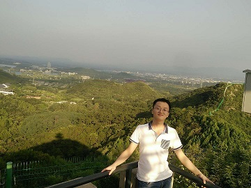

#Haolin Liu

 This is my [CV](https://www.mkdocs.org).
###Short Bio
****
Haolin Liu is a Master degree candidate stduent of the IMSG Lab, The University of Chinese Academy of Sciences.
His supervisor is Associate Research fellow [Shiming Ge](http://people.ucas.ac.cn/~geshiming)
###Contact
****
* liuhaolin@iie.ac.cn
* C11 east, No.65, middle xingshikou Road, Sijiqing Town, Haidian District, Beijing.
* Institute of Information Engineering, Chinese Academy of Sciences.

###Research Interests
****
* Face Detection
* Object Tracking
* AI Security
* Differential Privacy

###Publication
****
Look One and More: Distilling Hybrid Order Relational Knowledge for Cross-Resolution Image Recognition. AAAI 2020 Oral.
 Shiming Ge, Kangkai Zhang, Haolin Liu, Yingying Hua, Shengwei Zhao, Xin Jin*, and Hao Wen

Extracting Features of Interest from Small Deep Networks for Efficient Visual Tracking, 19th Pacific-Rim Conference on Multimedia (PCM), 2018
  Zhao Luo, Shiming Ge*, Yingying Hua, Haolin Liu, and Xin Jin.

Generative image inpainting with neural features. In ACM ICIMCS 2018
  Haolin Liu, Chenyu Li, Shiming Ge*, Shengwei Zhao, and Xin Jin.

###Awards
****
* 1st Place Award in The 1st Anti-UAV Workshop & Challenge - CVPR Workshops, 2020